# Домашнее задание к занятию "`Системы контроля версий`" - `Дедюрин Денис`

Создаем репозиторий в GitHub:
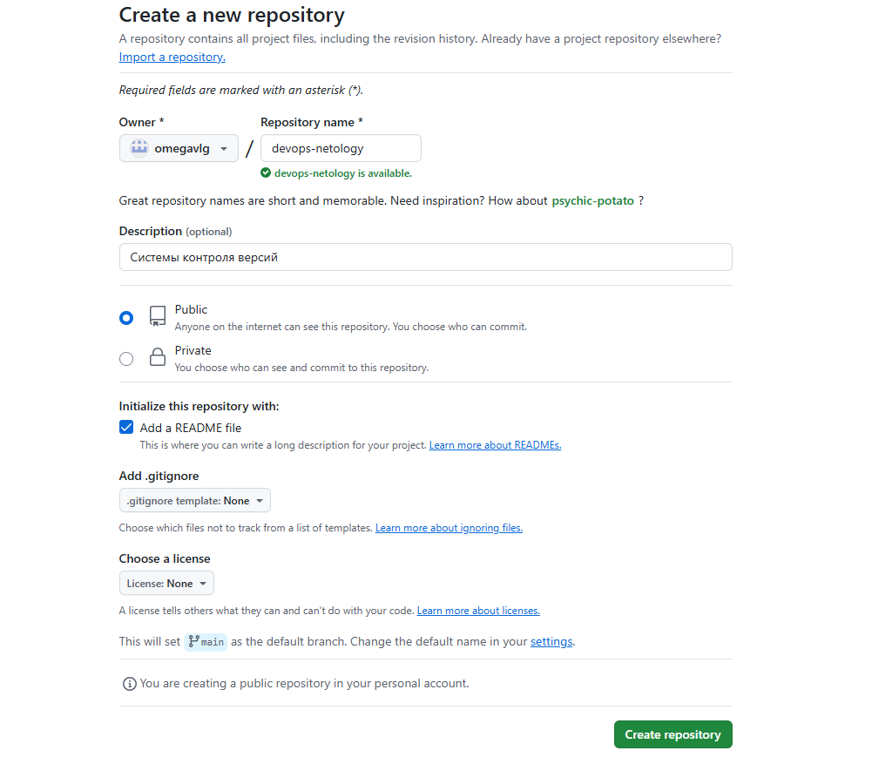

Клонируем его:
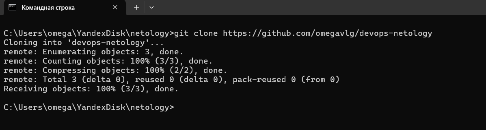

Переходим в директорию клонированного репозитория и выполняем git status:
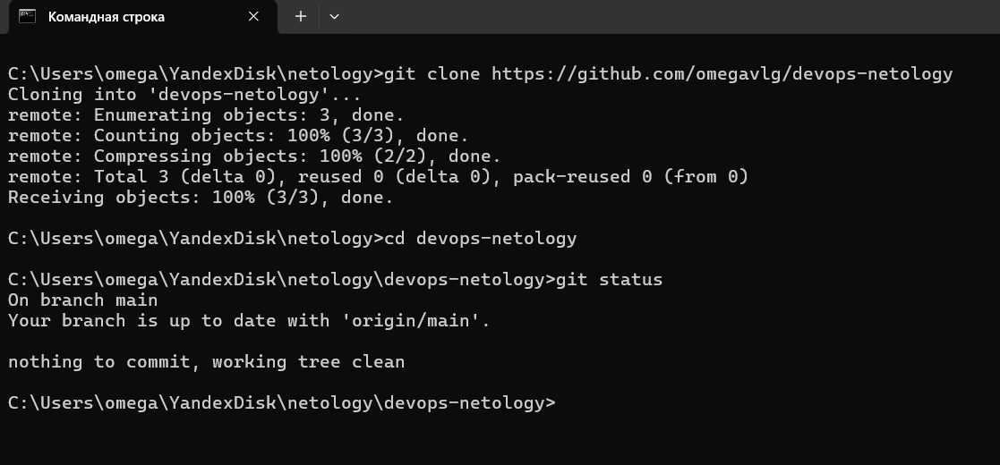

Редактируем файл README.md, добавляем директорию с картинками, тем самым переведя файл в состояние Modified.
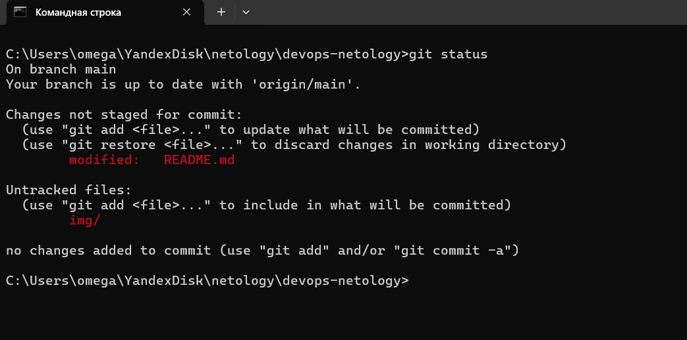

Выполняем команду git diff, чтобы увидеть изменения
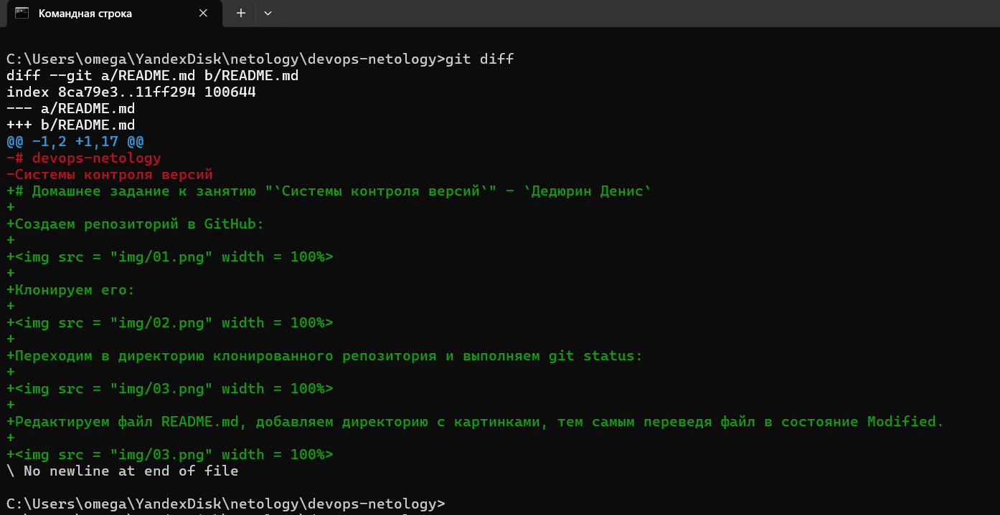

git add . и git status
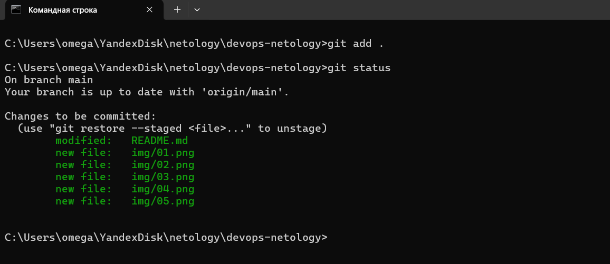

Выполняем команду git diff --staged
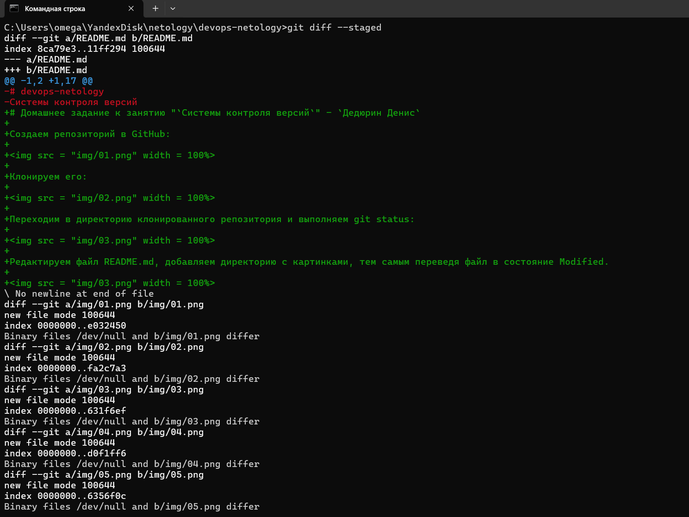

Выполняем коммит
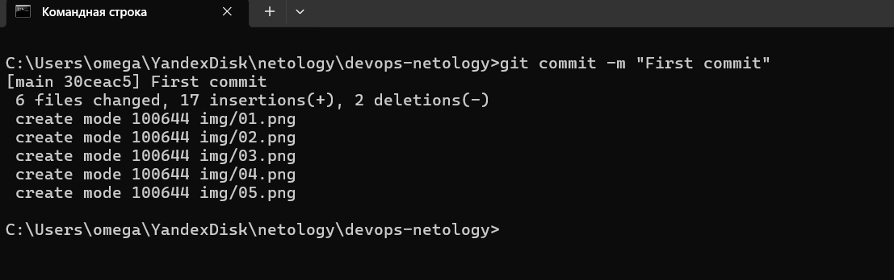

И снова git status
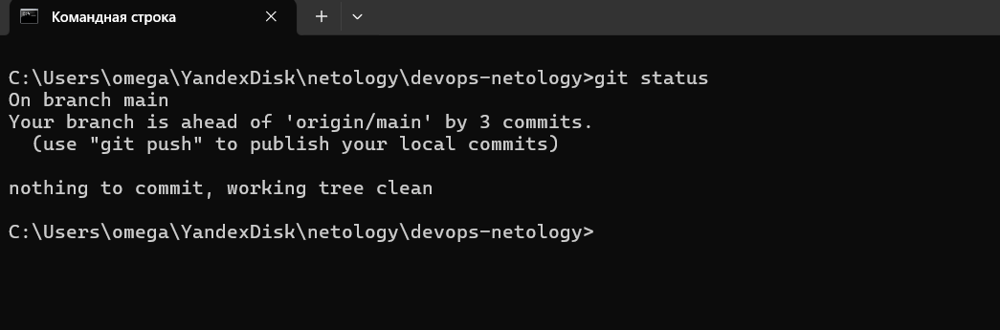

Выполняем команду git push, чтобы опубликовать все изменения.
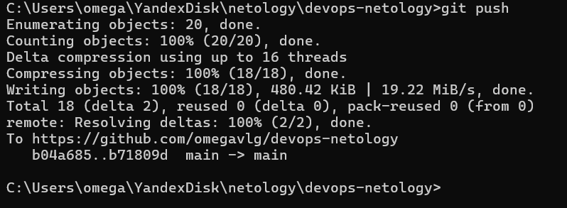

Создадим файл .gitignore, выполним git add . и git status
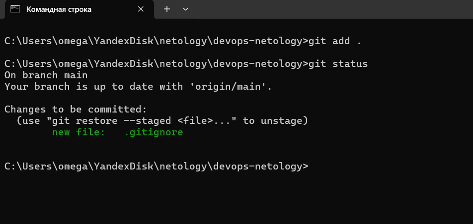

Создадим директорию terraform и в ней так же разместим файл .gitignore с содержимым указанным в задании.
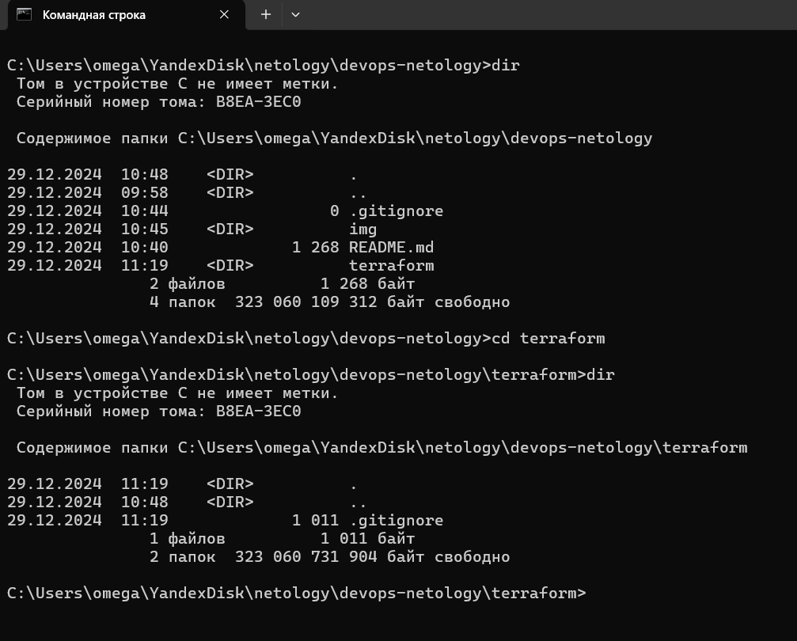
```
# Local .terraform directories
**/.terraform/*

# .tfstate files
*.tfstate
*.tfstate.*

# Crash log files
crash.log
crash.*.log

# Exclude all .tfvars files, which are likely to contain sensitive data, such as
# password, private keys, and other secrets. These should not be part of version 
# control as they are data points which are potentially sensitive and subject 
# to change depending on the environment.
*.tfvars
*.tfvars.json

# Ignore override files as they are usually used to override resources locally and so
# are not checked in
override.tf
override.tf.json
*_override.tf
*_override.tf.json

# Ignore transient lock info files created by terraform apply
.terraform.tfstate.lock.info

# Include override files you do wish to add to version control using negated pattern
# !example_override.tf

# Include tfplan files to ignore the plan output of command: terraform plan -out=tfplan
# example: *tfplan*

# Ignore CLI configuration files
.terraformrc
terraform.rc
```

В нем игнорируются следующие файлы и каталоги:

- Каталог `.terraform` и все его содержимое.
- Файлы с расширением `.tfstate` и их версии.
- Логи крашей (`crash.log` и `crash.*.log`).
- Файлы с расширением `.tfvars` и `.tfvars.json`, которые могут содержать чувствительные данные.
- Файлы переопределений (`override.tf`, `override.tf.json` и их шаблоны).
- Временные файлы блокировки состояния Terraform (`.terraform.tfstate.lock.info`).
- Конфигурационные файлы CLI (`.terraformrc` и `terraform.rc`).

Создаем файлы will_be_deleted.txt (с текстом will_be_deleted) и will_be_moved.txt (с текстом will_be_moved) и коммитим их с комментарием Prepare to delete and move.
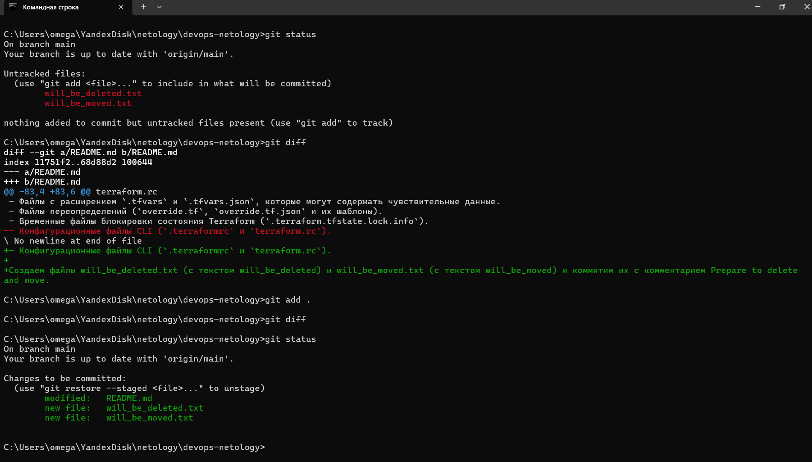
